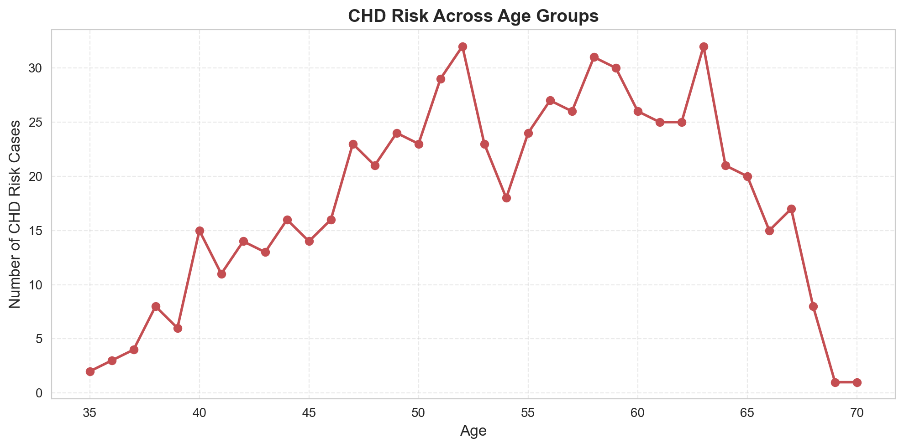

# Heart Attack Risk Analysis

This project analyzes the **Framingham Heart Study dataset** to predict the risk of heart attacks. It includes a Jupyter Notebook with **data analysis, visualizations, and insights** to understand key factors affecting heart attack risk.

---

## Features

- Exploratory Data Analysis (EDA) of health dataset  
- Visualization of important factors such as:
  - Age
  - Gender
  - Smoking
  - Hypertension
  - Glucose Level
  - Population statistics  
- Heart attack risk prediction insights

---

## Technologies Used

- Python  
- Pandas  
- Matplotlib / Seaborn

---

## Usage Instructions

1. Clone the repository:

```bash
git clone https://github.com/Jinoraj25/Heart_Attack_Risk_Analysis.git
```

2. Open the notebook:

```bash
Heart Disease Risk Prediction Using Real-World Health Data (Framingham Study) (1).ipynb
```

3. Run the cells sequentially to see analysis and plots.  
4. All generated plots are saved in the `images/` folder.

---

## Repository Structure

```
Heart_Attack_Risk_Analysis/
│
├─ Heart Disease Risk Prediction Using Real-World Health Data (Framingham Study) (1).ipynb
├─ images/             # All visualization plots
│   ├─ age_heart_attack.png
│   ├─ gender_heart_attack.png
│   ├─ glucoselevel_heart_attack.png
│   └─ ... other plots
├─ README.md
```

---

## Visualizations

All key plots are saved in the `images` folder and also displayed inline in the notebook.  
Example:



---

## Author

**Jino G J**  
GitHub: [https://github.com/Jinoraj25](https://github.com/Jinoraj25)

